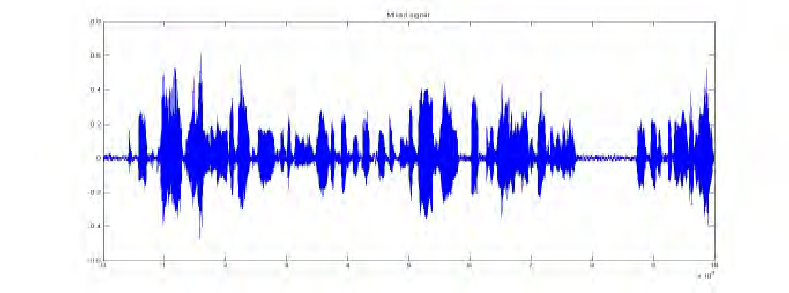

<!-- Improved compatibility of back to top link: See: https://github.com/Onyex101/Audio-Signal-Classifier-CNN/pull/73 -->
<a name="readme-top"></a>
<!--
*** Thanks for checking out the Best-README-Template. If you have a suggestion
*** that would make this better, please fork the repo and create a pull request
*** or simply open an issue with the tag "enhancement".
*** Don't forget to give the project a star!
*** Thanks again! Now go create something AMAZING! :D
-->


<!-- PROJECT SHIELDS -->
<!--
*** I'm using markdown "reference style" links for readability.
*** Reference links are enclosed in brackets [ ] instead of parentheses ( ).
*** See the bottom of this document for the declaration of the reference variables
*** for contributors-url, forks-url, etc. This is an optional, concise syntax you may use.
*** https://www.markdownguide.org/basic-syntax/#reference-style-links
-->
[![Contributors][contributors-shield]][contributors-url]
[![Forks][forks-shield]][forks-url]
[![Stargazers][stars-shield]][stars-url]
[![Issues][issues-shield]][issues-url]
[![MIT License][license-shield]][license-url]
[![LinkedIn][linkedin-shield]][linkedin-url]


<!-- PROJECT LOGO -->
<br />
<div align="center">
  <a href="https://github.com/Onyex101/Audio-Signal-Classifier-CNN">
    
  </a>

  <h3 align="center">Audio Signal Classifier and Analysis</h3>

  <p align="center">
    An awesome README template to jumpstart your projects!
    <br />
    <a href="https://github.com/Onyex101/Audio-Signal-Classifier-CNN"><strong>Explore the docs »</strong></a>
    <br />
    <br />
    <a href="https://onyex101-audio-signal-classifier-cnn-streamlit-appmain-9vzexy.streamlit.app">View Demo</a>
    ·
    <a href="https://github.com/Onyex101/Audio-Signal-Classifier-CNN/issues">Report Bug</a>
    ·
    <a href="https://github.com/Onyex101/Audio-Signal-Classifier-CNN/issues">Request Feature</a>
  </p>
</div>


<!-- TABLE OF CONTENTS -->
<details>
  <summary>Table of Contents</summary>
  <ol>
    <li>
      <a href="#about-the-project">About The Project</a>
      <ul>
        <li><a href="#built-with">Built With</a></li>
      </ul>
    </li>
    <li>
      <a href="#getting-started">Getting Started</a>
      <ul>
        <li><a href="#prerequisites">Prerequisites</a></li>
        <li><a href="#installation">Installation</a></li>
      </ul>
    </li>
    <li><a href="#usage">Usage</a></li>
    <li><a href="#roadmap">Roadmap</a></li>
    <li><a href="#contributing">Contributing</a></li>
    <li><a href="#license">License</a></li>
    <li><a href="#contact">Contact</a></li>
    <li><a href="#acknowledgments">Acknowledgments</a></li>
  </ol>
</details>


<!-- ABOUT THE PROJECT -->
## About The Project

![Project ScreenShot][product-screenshot]

Machine Learning project to analyze and extract sound signal features from audio files using Mel-Frequency Cepstral Coefficients(MFCC). A Convolutional Neural Networks (CNN) model is used to build and train the model with the UrbanSound8K Dataset [link](https://urbansounddataset.weebly.com/download-urbansound8k.html).Finally We Predict an Audio File's Class Using Our CNN Deep Learning Model.
<p><strong>Python Libraries used in the Project</strong></p> 
<ul>
    <li>Librosa</li>
    <li>Numpy</li>
    <li>Streamlit</li>
    <li>Tensoflow</li>
</ul>

<p align="right">(<a href="#readme-top">back to top</a>)</p>


### Built With

* [![tensorFlow][tensorFlow]][tensorFlow-url]
* [![NumPy][NumPy]][NumPy-url]
* [![pandas][pandas]][pandas-url]

<p align="right">(<a href="#readme-top">back to top</a>)</p>


<!-- GETTING STARTED -->
## Getting Started

### Prerequisites

This is an example of how to list things you need to use the software and how to install them.
* pip
  ```sh
  pip install -r requirements.txt
  ```

### Installation

_Below is an example of how you can instruct your audience on installing and setting up your app. This template doesn't rely on any external dependencies or services._

1. Get a free API Key at [https://example.com](https://example.com)
2. Clone the repo
   ```sh
   git clone https://github.com/Onyex101/Audio-Signal-Classifier-CNN.git
   ```
3. Install PIP packages
   ```sh
   pip install -r requirements.txt
   ```
4. start the streamlit app
   ```sh
   streamlit run streamlit_app/main.py
   ```

<p align="right">(<a href="#readme-top">back to top</a>)</p>


<!-- USAGE EXAMPLES -->
## Usage

Use this space to show useful examples of how a project can be used. Additional screenshots, code examples and demos work well in this space. You may also link to more resources.

_For more examples, please refer to the [Documentation](https://example.com)_

<p align="right">(<a href="#readme-top">back to top</a>)</p>


<!-- ROADMAP -->
## Roadmap

- [x] Add Changelog
- [x] Add back to top links
- [ ] Add Additional Templates w/ Examples
- [ ] Add "components" document to easily copy & paste sections of the readme
- [ ] Multi-language Support
    - [ ] Chinese
    - [ ] Spanish

See the [open issues](https://github.com/Onyex101/Audio-Signal-Classifier-CNN/issues) for a full list of proposed features (and known issues).

<p align="right">(<a href="#readme-top">back to top</a>)</p>


<!-- CONTRIBUTING -->
## Contributing

Contributions are what make the open source community such an amazing place to learn, inspire, and create. Any contributions you make are **greatly appreciated**.

If you have a suggestion that would make this better, please fork the repo and create a pull request. You can also simply open an issue with the tag "enhancement".
Don't forget to give the project a star! Thanks again!

1. Fork the Project
2. Create your Feature Branch (`git checkout -b feature/AmazingFeature`)
3. Commit your Changes (`git commit -m 'Add some AmazingFeature'`)
4. Push to the Branch (`git push origin feature/AmazingFeature`)
5. Open a Pull Request

<p align="right">(<a href="#readme-top">back to top</a>)</p>


<!-- LICENSE -->
## License

Distributed under the MIT License. See `LICENSE.txt` for more information.

<p align="right">(<a href="#readme-top">back to top</a>)</p>


<!-- CONTACT -->
## Contact

Project Link: [https://github.com/Onyex101/Audio-Signal-Classifier-CNN](https://github.com/Onyex101/Audio-Signal-Classifier-CNN)

<p align="right">(<a href="#readme-top">back to top</a>)</p>


<!-- ACKNOWLEDGMENTS -->
## Acknowledgments

* [Udemy](https://www.udemy.com/course/deep-learning-with-python-course/)
* [Choose an Open Source License](https://choosealicense.com)
* [Img Shields](https://shields.io)
* [GitHub Pages](https://pages.github.com)

<p align="right">(<a href="#readme-top">back to top</a>)</p>


<!-- MARKDOWN LINKS & IMAGES -->
<!-- https://www.markdownguide.org/basic-syntax/#reference-style-links -->
[contributors-shield]: https://img.shields.io/github/contributors/othneildrew/Best-README-Template.svg?style=for-the-badge
[contributors-url]: https://github.com/Onyex101/Audio-Signal-Classifier-CNN/graphs/contributors
[forks-shield]: https://img.shields.io/github/forks/othneildrew/Best-README-Template.svg?style=for-the-badge
[forks-url]: https://github.com/Onyex101/Audio-Signal-Classifier-CNN/network/members
[stars-shield]: https://img.shields.io/github/stars/othneildrew/Best-README-Template.svg?style=for-the-badge
[stars-url]: https://github.com/Onyex101/Audio-Signal-Classifier-CNN/stargazers
[issues-shield]: https://img.shields.io/github/issues/othneildrew/Best-README-Template.svg?style=for-the-badge
[issues-url]: https://github.com/Onyex101/Audio-Signal-Classifier-CNN/issues
[license-shield]: https://img.shields.io/github/license/othneildrew/Best-README-Template.svg?style=for-the-badge
[license-url]: https://github.com/Onyex101/Audio-Signal-Classifier-CNN/blob/master/LICENSE.txt
[linkedin-shield]: https://img.shields.io/badge/-LinkedIn-black.svg?style=for-the-badge&logo=linkedin&colorB=555
[linkedin-url]: https://www.linkedin.com/in/onyekachi-okoye-37b585b6/
[product-screenshot]: images/main.png
[tensorFlow]: https://img.shields.io/badge/TensorFlow-FF6F00?style=for-the-badge&logo=tensorflow&logoColor=white
[pandas]: https://img.shields.io/static/v1?style=for-the-badge&message=pandas&color=150458&logo=pandas&logoColor=FFFFFF&label=
[NumPy]: https://img.shields.io/static/v1?style=for-the-badge&message=NumPy&color=013243&logo=NumPy&logoColor=FFFFFF&label=
[tensorFlow-url]: https://www.tensorflow.org/
[NumPy-url]: https://numpy.org/
[pandas-url]: https://pandas.pydata.org/